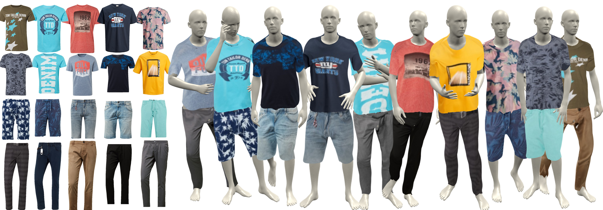
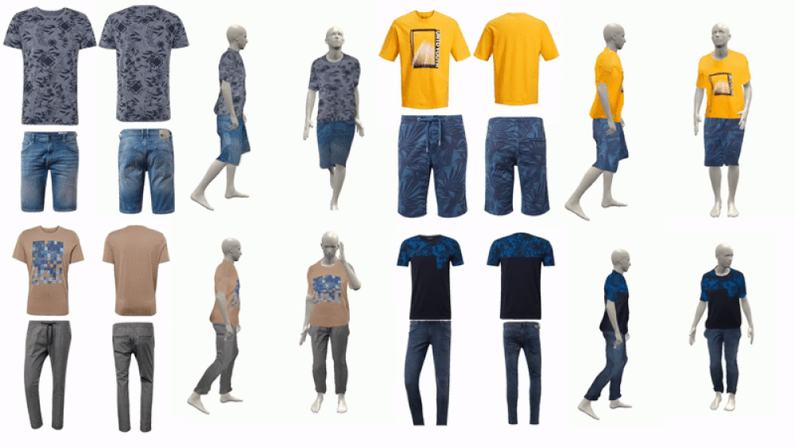

# The readme file contains most of the documentation from the original repo.
# important changes :
1. Run demo_requirments.sh and download_assets.sh for demo
2. To prepare data for further training use the data_prep.sh script
3. You need to install blender 2.79 for your system, and this is not included in the sh files. This is required to run demo
4. Download smpl weights from https://smpl.is.tue.mpg.de/downloads. 
5. Extract and copy the folder name smpl to the ./site-packages/your_vir_env/psbody-mesh . after that psbody-mesh will have 2 folder mesh and smpl. [Follow this issue](https://github.com/aymenmir1/pix2surf/issues/4). Note smpl is required for data preparation for further training. You don't need to install smpl and mesh to run demo.py
6. The import changes for the psbody mesh and smpl are added to the files

# Learning to Transfer Texture from Clothing Images to 3D Humans (CVPR 2020)

>[Learning to Transfer Texture from Clothing Images to 3D Humans](https://arxiv.org/abs/2003.02050)  
[Aymen Mir](https://virtualhumans.mpi-inf.mpg.de/people/Mir.html), [Thiemo Alldieck](https://virtualhumans.mpi-inf.mpg.de/people/Alldieck.html), [Gerard Pons-Moll](https://virtualhumans.mpi-inf.mpg.de/people/pons-moll.html)  
*Proceedings of IEEE Conference on Computer Vision and Pattern Recognition 2020*




This repository contains code corresponding to the paper "Learning to Transfer Texture from Clothing Images to 3D Humans"

# Demo

To run the demo you will need blender. This code has been tested with blender 2.79. Please download it from [here](https://download.blender.org/release/Blender2.79/). 

Clone the repo:

`git clone https://github.com/trinanjan12/pix2surf`

Install the requirements using conda:

`source scripts/demo_requirments.sh`

Download pretrained weights and other assets:

`source scripts/download_assets.sh`

Running the demo is as simple as:

`python demo.py` 

The script produces a video in which the front and back views of a T-shirt and a pair of shorts are rendered atop a textured SMPL mesh. 
By changing the parameters in the script, different textures and garment classes can be rendered atop SMPL. 
Example:

`python demo.py --pose_id 2 --img_id 4 --low_type 'pants'`

We provide five pairs of upper and lower clothing images to run our demo script. Please note that we do not own the copyrights of the clothing images. These are released merely for demonstration and should not be used for any other purpose.
By excuting the script to download data, you automatically consent to the [license agreement](https://smpl.is.tue.mpg.de/bodylicense) of the SMPL body.

# Training
The training data for all neural models was obtained from the following websites:
1) [Zalando](https://en.zalando.de/mens-clothing/)
2) [Jack and Jones](https://www.jackjones.com/de/de/jj/bekleidung/)
3) [Tom-Tailor](https://www.tom-tailor.eu/men-startpage)

We do not own the copyrights to these images. These can be downloaded using a web scraper.
Once this is done, we obtain silhouettes of these clothing images by a mixture of manual and autmatic execution of [grab cut](https://docs.opencv.org/3.4/d8/d83/tutorial_py_grabcut.html) .

Sample masks and texture images are stored in the `./train/data` directory. 
The code for obtaining the correspondence and texture maps is in the `./prep_data` directory. All three scripts for silhouette matching, correspondence extraction and texture map extraction can be executed using the command

`cd prep_data && python ./run.py`

Install the requirements using virtualenv:

`source scripts/data_prep.sh`

Once the data has been obtained, the mapping and segmentation networks can be trained using the scripts provided in the `train` directory using the commands :

`python train_seg.py`

`python train_map.py`

# Citation
If you find our code useful, please consider citing our paper 

```
@inproceedings{mir20pix2surf,
    title = {Learning to Transfer Texture from Clothing Images to 3D Humans},  
    author = {Mir, Aymen and Alldieck, Thiemo and Pons-Moll, Gerard},  
    booktitle = {{IEEE} Conference on Computer Vision and Pattern Recognition (CVPR)}, 
    month = {jun},
    organization = {{IEEE}},
    year = {2020},
} 
```

# License
This code is available for **non-commercial scientific research purposes** as defined in the [LICENSE file](./LICENSE.txt). By downloading and using this code you agree to the terms in the LICENSE. 
